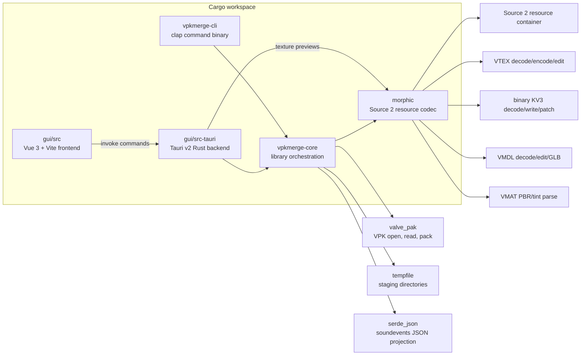
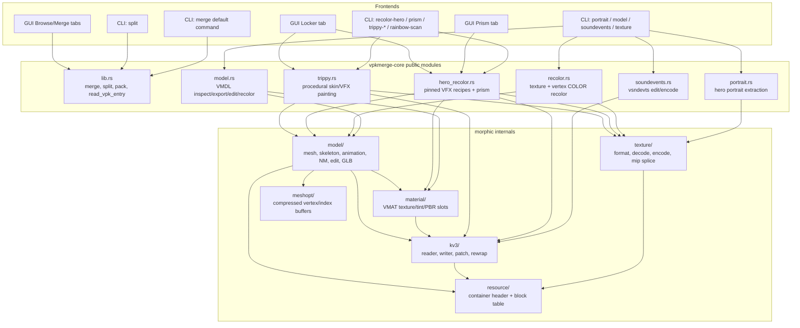
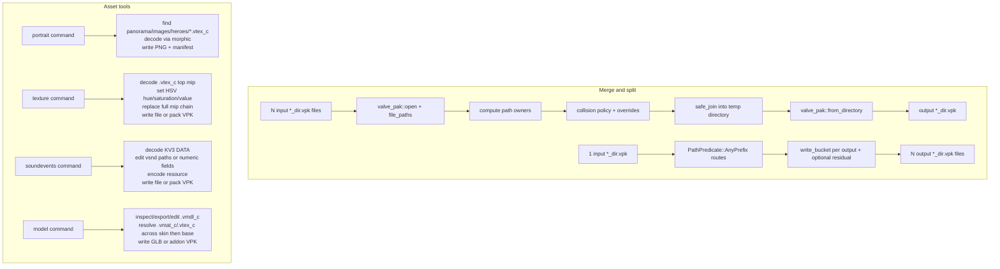
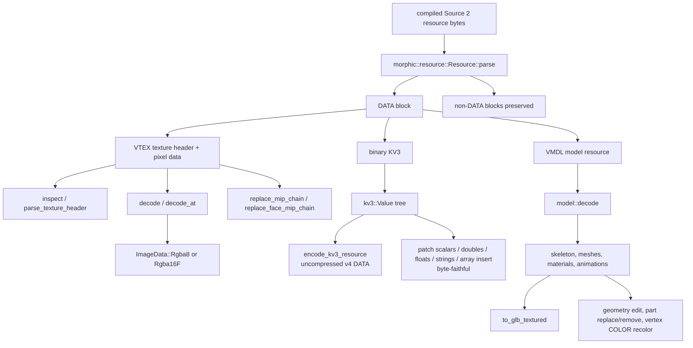
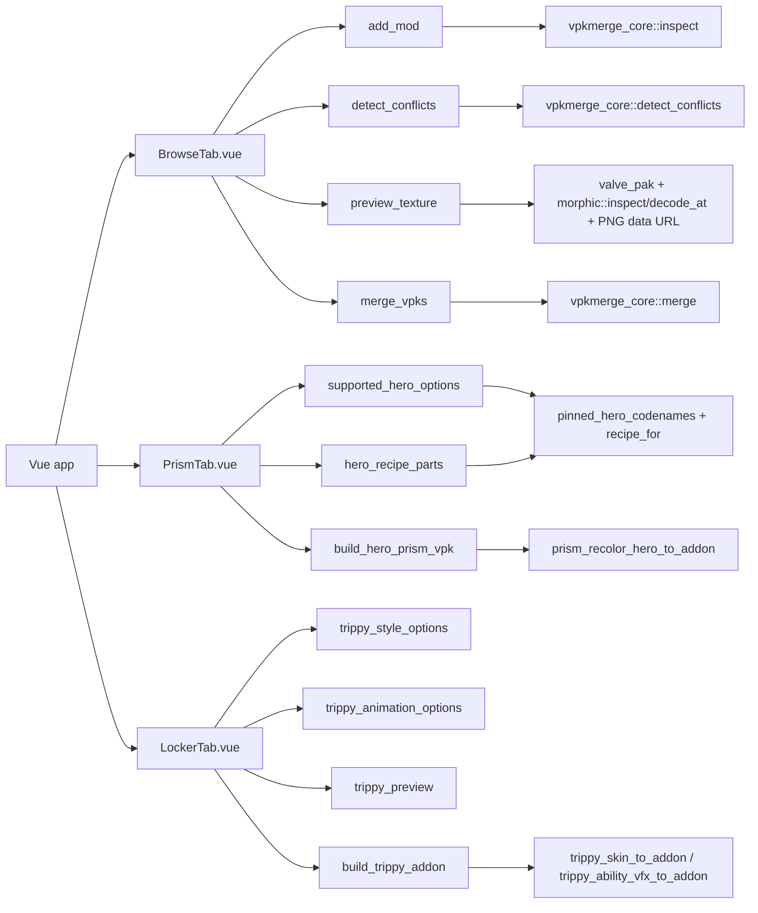
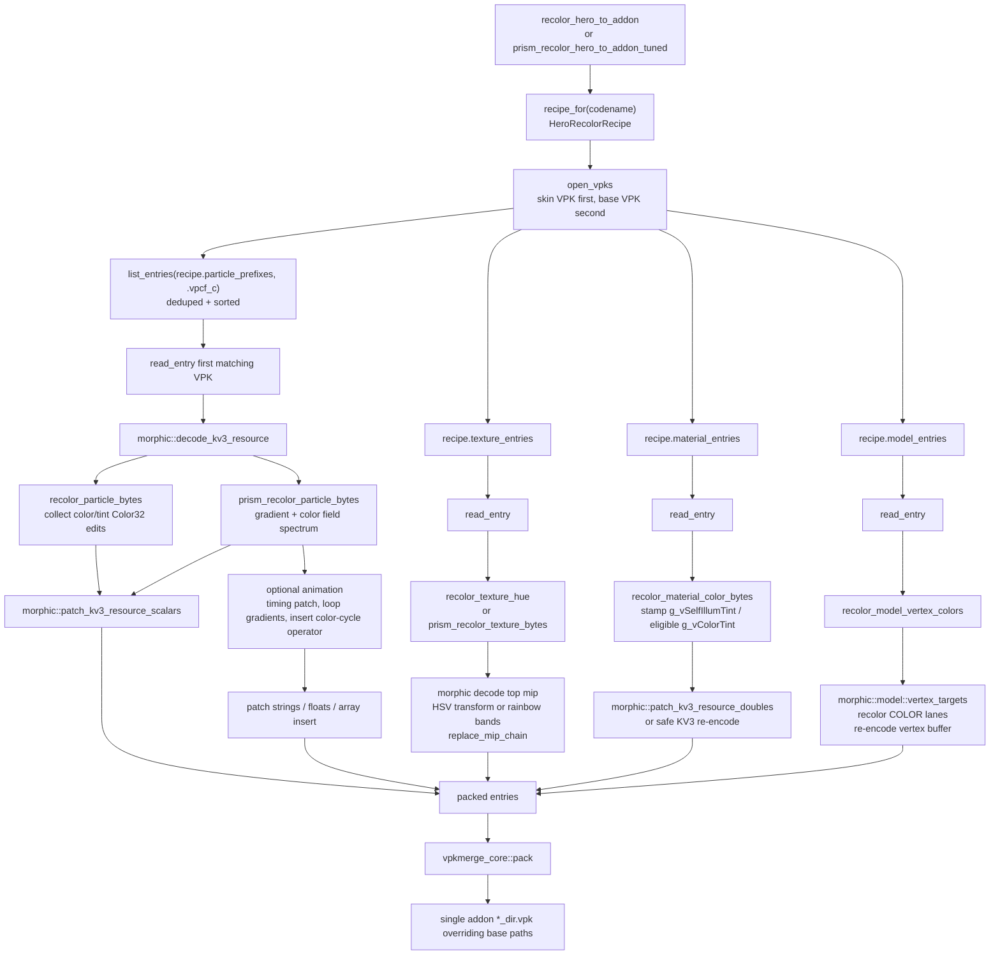
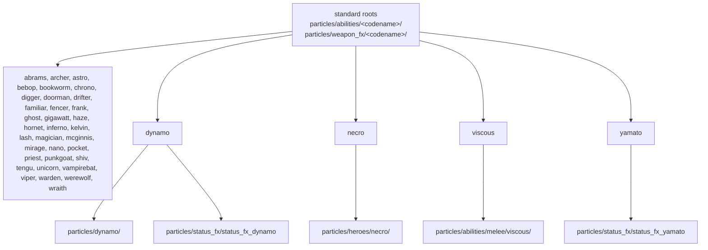

# vpkmerge Mermaid Architecture

This document is a Mermaid-first map of the current repository architecture and
the Deadlock hero recolor recipe surface.

Source files used as the source of truth:

- `Cargo.toml`
- `vpkmerge-core/src/lib.rs`
- `vpkmerge-core/src/hero_recolor.rs`
- `vpkmerge-core/src/recolor.rs`
- `vpkmerge-core/src/model.rs`
- `vpkmerge-core/src/portrait.rs`
- `vpkmerge-core/src/soundevents.rs`
- `vpkmerge-core/src/trippy.rs`
- `morphic/src/lib.rs`
- `gui/src-tauri/src/lib.rs`
- `vpkmerge-cli/src/main.rs`

## Workspace Architecture

## Crate Boundaries

## Main Data Flows

## Source 2 Codec Layer

## GUI Command Surface

## Hero Recolor Pipeline

## Hero Recolor Coverage

```mermaid
flowchart TB
    ROOT["Pinned hero recolor recipes<br/>vpkmerge-core/src/hero_recolor.rs"] --> PARTICLE_ONLY["Particles only"]
    ROOT --> PARTICLE_TEXTURE["Particles + explicit .vtex_c textures"]
    ROOT --> MATERIAL_TINT["Also .vmat_c tint constants"]
    ROOT --> MODEL_COLOR["Also .vmdl_c vertex COLOR"]
    ROOT --> SPECIAL_PRISM["Special prism handling"]

    PARTICLE_ONLY --> astro["astro / Holliday"]
    PARTICLE_ONLY --> bebop["bebop"]
    PARTICLE_ONLY --> gigawatt["gigawatt / Seven"]
    PARTICLE_ONLY --> hornet["hornet / Vindicta"]
    PARTICLE_ONLY --> inferno["inferno / Infernus"]
    PARTICLE_ONLY --> mirage["mirage"]
    PARTICLE_ONLY --> punkgoat["punkgoat / Billy"]
    PARTICLE_ONLY --> shiv["shiv"]
    PARTICLE_ONLY --> vampirebat["vampirebat / Mina"]
    PARTICLE_ONLY --> wraith["wraith"]

    PARTICLE_TEXTURE --> abrams["abrams"]
    PARTICLE_TEXTURE --> archer["archer / Grey Talon"]
    PARTICLE_TEXTURE --> bookworm["bookworm / Paige"]
    PARTICLE_TEXTURE --> chrono["chrono / Paradox"]
    PARTICLE_TEXTURE --> digger["digger / Mo and Krill"]
    PARTICLE_TEXTURE --> doorman["doorman"]
    PARTICLE_TEXTURE --> drifter["drifter"]
    PARTICLE_TEXTURE --> dynamo["dynamo"]
    PARTICLE_TEXTURE --> familiar["familiar"]
    PARTICLE_TEXTURE --> fencer["fencer / Apollo"]
    PARTICLE_TEXTURE --> frank["frank / Victor"]
    PARTICLE_TEXTURE --> ghost["ghost / Lady Geist"]
    PARTICLE_TEXTURE --> haze["haze"]
    PARTICLE_TEXTURE --> kelvin["kelvin"]
    PARTICLE_TEXTURE --> lash["lash"]
    PARTICLE_TEXTURE --> magician["magician / Sinclair"]
    PARTICLE_TEXTURE --> mcginnis["mcginnis"]
    PARTICLE_TEXTURE --> nano["nano / Calico"]
    PARTICLE_TEXTURE --> necro["necro / Graves"]
    PARTICLE_TEXTURE --> pocket["pocket"]
    PARTICLE_TEXTURE --> priest["priest"]
    PARTICLE_TEXTURE --> tengu["tengu / Ivy"]
    PARTICLE_TEXTURE --> unicorn["unicorn / Celeste"]
    PARTICLE_TEXTURE --> viper["viper / Vyper"]
    PARTICLE_TEXTURE --> viscous["viscous"]
    PARTICLE_TEXTURE --> warden["warden"]
    PARTICLE_TEXTURE --> werewolf["werewolf"]
    PARTICLE_TEXTURE --> yamato["yamato"]

    MATERIAL_TINT --> dynamo
    MATERIAL_TINT --> frank
    MATERIAL_TINT --> necro
    MATERIAL_TINT --> viscous

    MODEL_COLOR --> bookworm

    SPECIAL_PRISM --> bebop_passthrough["bebop projected laser decals stay vanilla"]
    SPECIAL_PRISM --> yamato_bands["yamato shadow status textures get rainbow bands when animated"]
    SPECIAL_PRISM --> yamato_muted["yamato shadow shape texture gets muted blue prism hue"]
    SPECIAL_PRISM --> projected_bands["animated projected texture rainbow bands:<br/>digger, frank, dynamo, unicorn"]
```

## Particle Prefix Map

Every pinned hero touches all `.vpcf_c` files under its particle prefixes. Entries
are discovered at bake time from the input VPK(s), de-duplicated, and read from
skin VPK first, then base VPK.

## File-Level Texture Map 1

## File-Level Texture Map 2

## File-Level Texture Map 3

## Material and Model Extras

## Prism and Trippy Shared Mechanisms

```mermaid
flowchart TB
    PRISM["prism_recolor_hero_to_addon_tuned"] --> PARTICLE_PRISM["particle spectrum recolor"]
    PRISM --> TEXTURE_PRISM["texture spectrum recolor"]
    PRISM --> MATERIAL_PRISM["material tint spectrum"]
    PRISM --> MODEL_PRISM["vertex COLOR spectrum"]

    PARTICLE_PRISM --> GRADIENTS["gradient stops -> spectral ramps"]
    PARTICLE_PRISM --> COLORS["color/tint arrays -> themed hues"]
    PARTICLE_PRISM --> ANIMATED["optional animation"]
    ANIMATED --> TIMING["texture offset driven by particle age"]
    ANIMATED --> LOOP["loop age-driven color gradients"]
    ANIMATED --> CYCLE["insert runtime color-cycle operator"]

    TEXTURE_PRISM --> NORMAL_TEX["default: recolor_texture_hue"]
    TEXTURE_PRISM --> YAM_STATUS["animated Yamato shadow status:<br/>rainbowize_yamato_shadow_status_texture"]
    TEXTURE_PRISM --> PROJ_TEX["animated projected textures:<br/>rainbowize_projected_texture"]
    TEXTURE_PRISM --> YAM_SHAPE["Yamato shadow shape:<br/>muted cool prism hue"]

    TRIPPY["trippy_ability_vfx_to_addon"] --> RECIPE["recipe_for"]
    TRIPPY --> PAINT_TEX["paint recipe textures with procedural pattern"]
    TRIPPY --> PAINT_PART["reuse particle recolor + prism animation helpers"]
    TRIPPY --> PAINT_MAT["recolor material tints + optional scroll"]
    TRIPPY --> PAINT_MODEL["recolor vertex COLOR models"]
```

## Hero Recipe Catalog

This is the file-level source-of-truth catalog used by the diagrams above. All
texture paths listed here are explicit `texture_entries` in
`HeroRecolorRecipe`. Particle entries are dynamic: every `.vpcf_c` under the
listed prefixes is considered.

| Codename | Particle prefixes | Texture entries | Material entries | Model entries | Preview |
|---|---|---|---|---|---|
| `abrams` | `particles/abilities/abrams/` `particles/weapon_fx/abrams/` | `materials/particle/abilities/abrams/abrams_leap_ground_impact_hot_symbol_projected_vmat_g_tselfillum_670d93d.vtex_c` `materials/particle/projected/abrams_siphon_ground_projected_vmat_g_tselfillum_670d93d.vtex_c` | none | none | `materials/particle/abilities/abrams/abrams_leap_ground_impact_hot_symbol_projected_vmat_g_tselfillum_670d93d.vtex_c` |
| `archer` | `particles/abilities/archer/` `particles/weapon_fx/archer/` | `materials/particle/abilities/archer/archer_charged_shot_gradient_color_v2_psd_51e62704.vtex_c` `materials/particle/abilities/archer/archer_charged_shot_gradient_color_psd_17c02a47.vtex_c` `materials/particle/abilities/archer_guided_arrow_explosion_sphere_vmat_g_tcolor_a84e2808.vtex_c` `materials/models/particle/archer/archer_arrow_illum_vmat_g_tcolor_7d46cca1.vtex_c` `models/heroes_staging/archer/materials/archer_guided_arrow_color_psd_edd3d0f5.vtex_c` `models/heroes_staging/archer/bird/materials/bird_color_psd_117d09e0.vtex_c` | none | none | `materials/particle/abilities/archer/archer_charged_shot_gradient_color_v2_psd_51e62704.vtex_c` |
| `astro` | `particles/abilities/astro/` `particles/weapon_fx/astro/` | none | none | none | none |
| `bebop` | `particles/abilities/bebop/` `particles/weapon_fx/bebop/` | none | none | none | none |
| `bookworm` | `particles/abilities/bookworm/` `particles/weapon_fx/bookworm/` | `materials/particle/abilities/bookworm/bookworm_projectile_self_illum_vmat_g_tcolor_7b26a19f.vtex_c` `materials/particle/projected/bookworm_aoe_ground_projected_vmat_g_tselfillum_670d93d.vtex_c` `materials/particle/ground/ground_streak_bookworm_psd_5a44028c.vtex_c` `models/heroes_wip/bookworm/materials/bookworm_ui_effects_color_psd_a29be817.vtex_c` `models/heroes_wip/bookworm/materials/bookworm_shield_illustrated_color_psd_81f5497b.vtex_c` `models/heroes_wip/bookworm/materials/bookworm_sword_illustrated_color_psd_4eb22603.vtex_c` `models/heroes_wip/bookworm/materials/bookworm_stone_illustrated_color_psd_8ed29960.vtex_c` `models/heroes_wip/bookworm/materials/bookworm_dragon_color_tga_ed3d3b5.vtex_c` `materials/models/particle/bookworm/neutral_black_dragon_color_psd_b8c8249f.vtex_c` | none | `models/particle/bookworm_horse_knight.vmdl_c` `models/particle/bookworm_mace.vmdl_c` | `models/heroes_wip/bookworm/materials/bookworm_ui_effects_color_psd_a29be817.vtex_c` |
| `chrono` | `particles/abilities/chrono/` `particles/weapon_fx/chrono/` | `models/heroes_staging/chrono/materials/chrono_fx_bubble02_color_psd_f57b1ef0.vtex_c` `models/heroes_staging/chrono/materials/chrono_fx_bubble04_color_psd_ee26af5c.vtex_c` | none | none | `models/heroes_staging/chrono/materials/chrono_fx_bubble04_color_psd_ee26af5c.vtex_c` |
| `digger` | `particles/abilities/digger/` `particles/weapon_fx/digger/` | `materials/particle/abilities/digger/digger_burrow_channel_ground_dark_projected_vmat_g_tselfillum_670d93d.vtex_c` `materials/particle/abilities/digger/digger_burrow_explode_ground_dark_projected_vmat_g_tselfillum_670d93d.vtex_c` `materials/particle/abilities/digger/digger_burrow_spin_ground_dark_projected_vmat_g_tselfillum_670d93d.vtex_c` | none | none | `materials/particle/abilities/digger/digger_burrow_explode_ground_dark_projected_vmat_g_tselfillum_670d93d.vtex_c` |
| `doorman` | `particles/abilities/doorman/` `particles/weapon_fx/doorman/` | `materials/particle/abilities/doorman/doorman_grenade_debuff_ground_projected_vmat_g_tselfillum_670d93d.vtex_c` | none | none | same as texture |
| `drifter` | `particles/abilities/drifter/` `particles/weapon_fx/drifter/` | `materials/particle/projected/drifter_claw_ground_projected_vmat_g_tselfillum_670d93d.vtex_c` | none | none | same as texture |
| `dynamo` | `particles/abilities/dynamo/` `particles/weapon_fx/dynamo/` `particles/dynamo/` `particles/status_fx/status_fx_dynamo` | `materials/particle/projected/dynamo_void_sphere_projected_ground_vmat_g_tselfillum_670d93d.vtex_c` `materials/particle/abilities/dynamo/dynamo_void_sphere_marker_symbol_psd_73d6401e.vtex_c` `materials/particle/abilities/dynamo/dynamo_void_sphere_planet_symbol.vtex_c` `materials/particle/abilities/dynamo/dynamo_void_sphere_sun_halo_symbol.vtex_c` `materials/particle/abilities/dynamo/dynamo_void_sphere_sun_symbol.vtex_c` | `materials/models/particle/dynamo_void_sphere_cyl.vmat_c` `materials/models/particle/dynamo_heal_buff_model.vmat_c` | none | `materials/particle/projected/dynamo_void_sphere_projected_ground_vmat_g_tselfillum_670d93d.vtex_c` |
| `familiar` | `particles/abilities/familiar/` `particles/weapon_fx/familiar/` | `materials/particle/abilities/familiar/familiar_naptime_coneradius_intersection_ground_projected_vmat_g_tselfillum_670d93d.vtex_c` `materials/particle/abilities/familiar/familiar_pillow_explode_ground_bright_projected_vmat_g_tselfillum_670d93d.vtex_c` `materials/particle/abilities/familiar/familiar_pillow_explode_ground_projected_vmat_g_tselfillum_670d93d.vtex_c` `materials/particle/abilities/familiar/familiar_spotlight_ground_edge_projected_vmat_g_tselfillum_670d93d.vtex_c` `materials/particle/abilities/familiar/familiar_spotlight_ground_projected_vmat_g_tselfillum_670d93d.vtex_c` | none | none | `materials/particle/abilities/familiar/familiar_spotlight_ground_projected_vmat_g_tselfillum_670d93d.vtex_c` |
| `fencer` | `particles/abilities/fencer/` `particles/weapon_fx/fencer/` | `materials/particle/projected/fencer_preview_line_projected_decal_vmat_g_tselfillum_670d93d.vtex_c` `materials/particle/projected/fencer_sigil_pentagram_projected_vmat_g_tselfillum_670d93d.vtex_c` `materials/particle/abilities/fencer/fencer_ult_gradient_color_psd_51322651.vtex_c` `models/heroes_wip/fencer/materials/fencer_sword_color_tga_52ec8bfe.vtex_c` | none | none | `materials/particle/abilities/fencer/fencer_ult_gradient_color_psd_51322651.vtex_c` |
| `frank` | `particles/abilities/frank/` `particles/weapon_fx/frank/` | `materials/particle/abilities/frank/frank_painaura_aoe_ground_projected_vmat_g_tselfillum_670d93d.vtex_c` `materials/particle/abilities/frank/frank_revive_marker_ground_projected_vmat_g_tselfillum_670d93d.vtex_c` `materials/particle/projected/frank_shock_miss_projected_bright_vmat_g_tselfillum_670d93d.vtex_c` | `materials/particle/abilities/frank/frank_painaura_sphere.vmat_c` | none | `materials/particle/abilities/frank/frank_painaura_aoe_ground_projected_vmat_g_tselfillum_670d93d.vtex_c` |
| `ghost` | `particles/abilities/ghost/` `particles/weapon_fx/ghost/` | `models/heroes_staging/ghost/materials/ghost2_clothes_fx_prop_color_psd_b398de35.vtex_c` `models/heroes_staging/ghost/materials/ghost2_clothes_color_png_fc80b39a.vtex_c` | none | none | `models/heroes_staging/ghost/materials/ghost2_clothes_fx_prop_color_psd_b398de35.vtex_c` |
| `gigawatt` | `particles/abilities/gigawatt/` `particles/weapon_fx/gigawatt/` | none | none | none | none |
| `haze` | `particles/abilities/haze/` `particles/weapon_fx/haze/` | `materials/particle/abilities/haze/haze_tracer_self_illum_vmat_g_tcolor_52a5b2da.vtex_c` | none | none | same as texture |
| `hornet` | `particles/abilities/hornet/` `particles/weapon_fx/hornet/` | none | none | none | none |
| `inferno` | `particles/abilities/inferno/` `particles/weapon_fx/inferno/` | none | none | none | none |
| `kelvin` | `particles/abilities/kelvin/` `particles/weapon_fx/kelvin/` | `materials/particle/projected/kelvin_ice_dome_projected_psd_d86c1818.vtex_c` `materials/particle/projected/kelvin_ice_dome_projected_psd_b5785889.vtex_c` `models/abilities/materials/ice_dome_color_psd_3a38e562.vtex_c` | none | none | `materials/particle/projected/kelvin_ice_dome_projected_psd_d86c1818.vtex_c` |
| `lash` | `particles/abilities/lash/` `particles/weapon_fx/lash/` | `materials/particle/cables/lash_cable_material_vmat_g_tcolor_8ca8af3e.vtex_c` | none | none | same as texture |
| `magician` | `particles/abilities/magician/` `particles/weapon_fx/magician/` | `materials/particle/projected/magician_hex_ground_projected_vmat_g_tselfillum_670d93d.vtex_c` `materials/particle/abilities/magician/magician_bolt_vmat_g_tcolor_978bc798.vtex_c` | none | none | `materials/particle/projected/magician_hex_ground_projected_vmat_g_tselfillum_670d93d.vtex_c` |
| `mcginnis` | `particles/abilities/mcginnis/` `particles/weapon_fx/mcginnis/` | `materials/particle/abilities/mcginnis/mcginnis_turret_ambient_goo_vmat_g_tcolor_974c5f09.vtex_c` `materials/particle/abilities/mcginnis/mcginnis_turret_ambient_goo_vmat_g_tsheen_7edd324d.vtex_c` | none | none | `materials/particle/abilities/mcginnis/mcginnis_turret_ambient_goo_vmat_g_tcolor_974c5f09.vtex_c` |
| `mirage` | `particles/abilities/mirage/` `particles/weapon_fx/mirage/` | none | none | none | none |
| `nano` | `particles/abilities/nano/` `particles/weapon_fx/nano/` | `materials/particle/abilities/nano/nano_ult_ground_dark_proj_vmat_g_tselfillum_670d93d.vtex_c` `models/heroes_staging/nano/cat_statue/materials/cat_statue_color_png_8892a790.vtex_c` | none | none | `materials/particle/abilities/nano/nano_ult_ground_dark_proj_vmat_g_tselfillum_670d93d.vtex_c` |
| `necro` | `particles/abilities/necro/` `particles/weapon_fx/necro/` `particles/heroes/necro/` | `models/heroes_wip/necro/materials/necro_shambler_color_tga_7b1de566.vtex_c` `models/heroes_wip/necro/materials/necro_shambler_vmat_g_tnprtransmissivecolor_337e62d.vtex_c` `models/heroes_wip/necro/materials/necro_jar_of_dread_color_tga_7f34b26.vtex_c` `models/heroes_wip/necro/materials/necro_jar_glass_color_tga_c6d5a0ec.vtex_c` `models/heroes_wip/necro/materials/necro_gravestone_color_tga_8a0745c.vtex_c` `models/heroes_wip/necro/materials/necro_gravestone_vmat_g_tnprtransmissivecolor_e8edad5e.vtex_c` `models/abilities/materials/necro_gravestone_destruction_vmat_g_tnprtransmissivecolor_e8edad5e.vtex_c` `models/heroes_wip/necro/materials/necro_hand_color_tga_b2300f7f.vtex_c` `models/heroes_wip/necro/materials/necro_hand_vmat_g_tnprtransmissivecolor_c987b5a.vtex_c` | `models/abilities/materials/necro_pickup_sphere.vmat_c` `materials/particle/abilities/necro/necro_jar_glass.vmat_c` `models/abilities/materials/necro_hands.vmat_c` `models/heroes_wip/necro/materials/necro_flame_effect_hand.vmat_c` `models/heroes_wip/necro/materials/necro_flame_effect.vmat_c` `models/heroes_wip/necro/materials/necro_picker_hand_effect.vmat_c` `models/heroes_wip/necro/materials/necro_picker_effect.vmat_c` `models/heroes_wip/necro/materials/picker_hand_glow.vmat_c` `models/heroes_wip/necro/materials/necro_gravestone.vmat_c` `models/abilities/materials/necro_gravestone_destruction.vmat_c` | none | none |
| `pocket` | `particles/abilities/pocket/` `particles/weapon_fx/pocket/` | `materials/particle/projected/pocket_satchel_projected_vmat_g_tselfillum_670d93d.vtex_c` `models/heroes_staging/synth/materials/pocket_body_color_png_eb808d8a.vtex_c` `materials/particle/abilities/pocket/pocket_magic_missile_illum_vmat_g_tcolor_754e94bd.vtex_c` `models/heroes_staging/synth/materials/pocket_suitcase_vmat_g_tcolor_e71e9d59.vtex_c` `models/abilities/materials/pocket_frog_small_color_png_e2620619.vtex_c` `models/abilities/materials/synth_deployable_color_psd_a57da819.vtex_c` | none | none | `materials/particle/projected/pocket_satchel_projected_vmat_g_tselfillum_670d93d.vtex_c` |
| `priest` | `particles/abilities/priest/` `particles/weapon_fx/priest/` | `materials/particle/abilities/priest/priest_flashbang_debuff_aoe_ground_projected_vmat_g_tselfillum_670d93d.vtex_c` `materials/particle/abilities/priest/priest_snaptrap_ground_projected_vmat_g_tselfillum_670d93d.vtex_c` `materials/particle/projected/priest_snaptrap_projectile_aoe_ground_projected_vmat_g_tselfillum_670d93d.vtex_c` | none | none | `materials/particle/abilities/priest/priest_snaptrap_ground_projected_vmat_g_tselfillum_670d93d.vtex_c` |
| `punkgoat` | `particles/abilities/punkgoat/` `particles/weapon_fx/punkgoat/` | none | none | none | none |
| `shiv` | `particles/abilities/shiv/` `particles/weapon_fx/shiv/` | none | none | none | none |
| `tengu` | `particles/abilities/tengu/` `particles/weapon_fx/tengu/` | `materials/particle/cables/ivy_vine_cable_vmat_g_tcolor_9509ed42.vtex_c` `models/abilities/materials/ivy_entangling_thorns_vmat_g_tcolor_59ac0039.vtex_c` | none | none | `models/abilities/materials/ivy_entangling_thorns_vmat_g_tcolor_59ac0039.vtex_c` |
| `unicorn` | `particles/abilities/unicorn/` `particles/weapon_fx/unicorn/` | `materials/particle/abilities/unicorn/unicorn_prismatic_shield_ground_warning_projected_vmat_g_tselfillum_670d93d.vtex_c` `materials/particle/projected/unicorn_beams_of_light_ground_projected_light_vmat_g_tselfillum_670d93d.vtex_c` `materials/particle/projected/unicorn_flux_rainbow_ground_projected_light_vmat_g_tselfillum_670d93d.vtex_c` `materials/particle/projected/unicorn_radiant_flare_ground_advance_projected_vmat_g_tselfillum_670d93d.vtex_c` `materials/particle/projected/unicorn_radiant_flare_ground_preview_projected_vmat_g_tselfillum_670d93d.vtex_c` `materials/particle/projected/unicorn_radiant_flare_ground_projected_vmat_g_tselfillum_670d93d.vtex_c` | none | none | `materials/particle/projected/unicorn_radiant_flare_ground_projected_vmat_g_tselfillum_670d93d.vtex_c` |
| `vampirebat` | `particles/abilities/vampirebat/` `particles/weapon_fx/vampirebat/` | none | none | none | none |
| `viper` | `particles/abilities/viper/` `particles/weapon_fx/viper/` | `materials/particle/abilities/viper/viper_petrify_symbol_ground_psd_a643967f.vtex_c` | none | none | same as texture |
| `viscous` | `particles/abilities/viscous/` `particles/weapon_fx/viscous/` `particles/abilities/melee/viscous/` | `materials/models/particle/viscous_puddle_telegraph_vmat_g_tcolor_ac749641.vtex_c` `materials/particle/abilities/viscous/viscous_detail_psd_a2817163.vtex_c` `materials/particle/abilities/viscous/viscous_detail_psd_3c03ec04.vtex_c` `materials/particle/abilities/viscous/viscous_detail_psd_4414414e.vtex_c` `models/heroes_staging/viscous/materials/viscous_punch_preview_vmat_g_tcolor_32414205.vtex_c` `models/heroes_staging/viscous/materials/viscous_punch_vmat_g_tcolor_afc99362.vtex_c` `models/heroes_staging/viscous/materials/viscous_fist_dissolve_vmat_g_tcolor_296284fc.vtex_c` `models/heroes_staging/viscous/materials/viscous_ball_vmat_g_tcolor_2c347bde.vtex_c` `models/abilities/materials/viscous_cube_color_png_81d0eb6a.vtex_c` `models/abilities/materials/viscous_cube_color_png_85c8b349.vtex_c` `models/abilities/materials/viscous_cube_color_png_daff99b9.vtex_c` `models/abilities/materials/viscous_sphere_color_png_4de0c542.vtex_c` `models/abilities/materials/viscous_fist_color_psd_ab531623.vtex_c` `models/abilities/materials/viscous_fist_color_psd_d8e8086a.vtex_c` | `models/abilities/materials/viscous_slime.vmat_c` `models/abilities/materials/viscous_slime_blobs.vmat_c` `models/abilities/materials/viscous_cube.vmat_c` `models/heroes_staging/viscous/materials/viscous_punch.vmat_c` `models/heroes_staging/viscous/materials/viscous_fist_dissolve.vmat_c` `models/heroes_staging/viscous/materials/viscous_ball.vmat_c` | none | `materials/models/particle/viscous_puddle_telegraph_vmat_g_tcolor_ac749641.vtex_c` |
| `warden` | `particles/abilities/warden/` `particles/weapon_fx/warden/` | `materials/models/particle/warden_tech_shield_scanline_color_psd_7e04e0b4.vtex_c` | none | none | same as texture |
| `werewolf` | `particles/abilities/werewolf/` `particles/weapon_fx/werewolf/` | `materials/particle/abilities/werewolf/werewolf_cripplingslash_ground_projected_vmat_g_tselfillum_670d93d.vtex_c` `materials/particle/projected/werewolf_transform_bite_ground_projected_vmat_g_tselfillum_670d93d.vtex_c` `materials/particle/projected/werewolf_transform_crushing_leap_ground_projected_vmat_g_tselfillum_670d93d.vtex_c` | none | none | `materials/particle/abilities/werewolf/werewolf_cripplingslash_ground_projected_vmat_g_tselfillum_670d93d.vtex_c` |
| `wraith` | `particles/abilities/wraith/` `particles/weapon_fx/wraith/` | none | none | none | none |
| `yamato` | `particles/abilities/yamato/` `particles/weapon_fx/yamato/` `particles/status_fx/status_fx_yamato` | `materials/particle/projected/yamato_blade_dash_ground_projected_vmat_g_tselfillum_670d93d.vtex_c` `materials/particle/abilities/yamato/yamato_shadow_redemption_complete_status.vtex_c` `materials/particle/abilities/yamato/yamato_shadow_redemption_nokill_status.vtex_c` `models/heroes_staging/yamato_v2/materials/yamoto_shadow_shape_color_psd_fe3c64a6.vtex_c` | none | none | `materials/particle/abilities/yamato/yamato_shadow_redemption_complete_status.vtex_c` |

